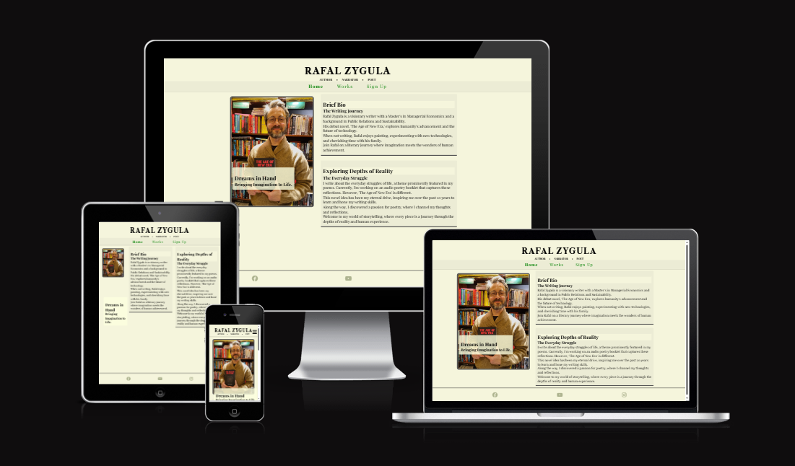

# Author Website

This project was ininitated to create a prototype for my first author website. I've been thinking about building such web space for quite a while now. I need a place where I will be able to share my literary works and engage with audience and build an email list. 

## Intro

**Project Descritpion**
A personal website for Rafal Zygula, a visionary writer and author of "THE AGE OF NEW ERA". Website will serve as a platform to showcase Rafal's literary works, share updates, and connect with readers and fans. The site includes a short about section, works section with selected works and links to works, and social medias, and a sign-up form to a newsletter.

**Purpose**
The maini purpose of this website is to create an engaging online presence for Rafal Zygula, allowing readers to learn more about his work, stay updated with his latest projects, and easily connect with him through various channels.

**User demographic**
The target audience:
    - readers and fans of Rafal Zygula's work.
    - literature enthusiasts interested in science-fiction and poetry, personal development, overcoming obstacles and future of human civilisation.
    - individuals looking for inspirational and thought-provoking content.

## Features
**Navbar**
    - a responsive navigation bar that adapts to different screen sizes.
    - includes links to Home, Works, and Sign Up pages.

**Footer** 
    - a footer with links to social media profiles, allowing users to connect with Rafal on Facebook, YouTube and Instagram.

**Animations** 
    - smooth scrolling and hover effects to enhance user experience

**Responsive Design**
    - the layout adjusts gracefully across various screen sizes, ensuring a consistent and user-friendly experience on all devices.

**Content Sections**
    - **Author Section**: Features an image and a brief introduction.
    - **Bio and Quotes**: Provides Insights into Rafal's writing journey and philosophical reflections.
    - **Works**: Provides the list of works and links to webshops where the work can be purchased.
    - **Sign-Up**: page with a sign-up form for the Rafal's newsletter and short description of benefits that come with signing up.
    
## Manual Testing

**QA**
Manual testing has been conducted to ensure the website functions as intended across different browsers and devices. Key aspects tested included:
    - navigation links
    - from submissions
    - responsiveness and layout integrity

**Bugs**
No significant bugs have been identified. Minor adjsutments were made to improve performance and user experience.

## Deployment

**Guided Setup**

Smooth transition to production

## Credits

CSS Styling Links:
https://www.w3schools.com/css/css_link.asp

Free Icons @ Font Awesome:
https://fontawesome.com/

Code Institute Love Running Project:
https://github.com/cptvalleyberg84/Love-Running/blob/3c4dabc87ed68d9f9ab2b2345180f57b7f3814ff/index.html
https://cptvalleyberg84.github.io/Love-Running/index.html
https://learn.codeinstitute.net/courses/course-v1:CodeInstitute+LRFX101+4/courseware/e805068059af42af87681032aa64053f/7525117e5cd144daa2a7b0c57843bbee/
https://www.youtube.com/watch?v=KvUJZfwiOyQ

How to reset/remove CSS styles for a specific element or selector only:
https://stackoverflow.com/questions/15901030/how-to-reset-remove-css-styles-for-a-specific-element-or-selector-only

HTML Validator
https://validator.w3.org/nu/#textarea

CSS Validator
https://jigsaw.w3.org/css-validator/#validate_by_input

Captain Anonymous
https://codepen.io/pen/

RGBA Color Picker
https://rgbacolorpicker.com/

Kevin Powell YouTube Channel
https://www.youtube.com/watch?v=hwbqquXww-U&list=PL4-IK0AVhVjMSb9c06AjRlTpvxL3otpUd

Slaying the Dragon YouTube Channel
https://www.youtube.com/watch?v=phWxA89Dy94

HTML Entity for the Middle Doc
https://stackoverflow.com/questions/7250381/html-entity-for-the-middle-dot

Website Design of:
https://www.lesleymmblume.com/

Wireframe with Balsamiq
https://balsamiq.com/

## Special Thanks

Code Institute HTML and CSS Essentials courses.

Would love to say thank you to the CI Tutor team for the help with placing the nav-toggle-label.

Big THANK YOU to my amazing Mentor Juliia_Konn (slack_id) for guidence and additional tips and tricks!

###### End of Project
